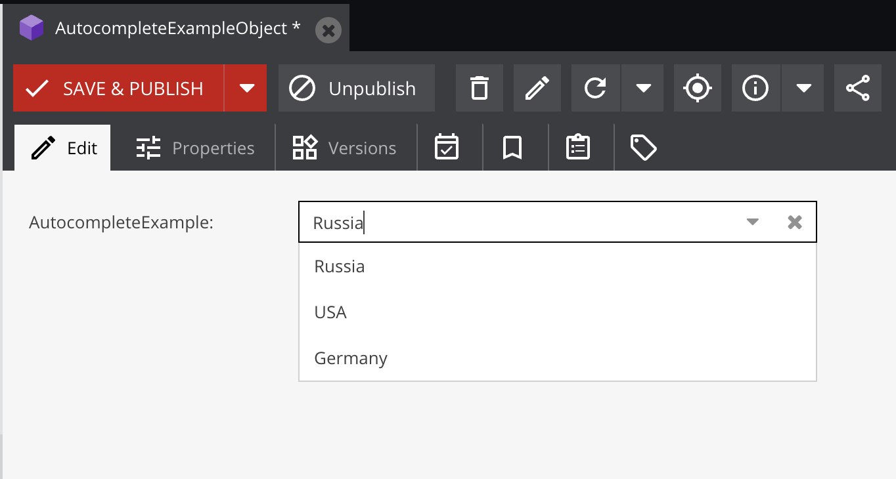
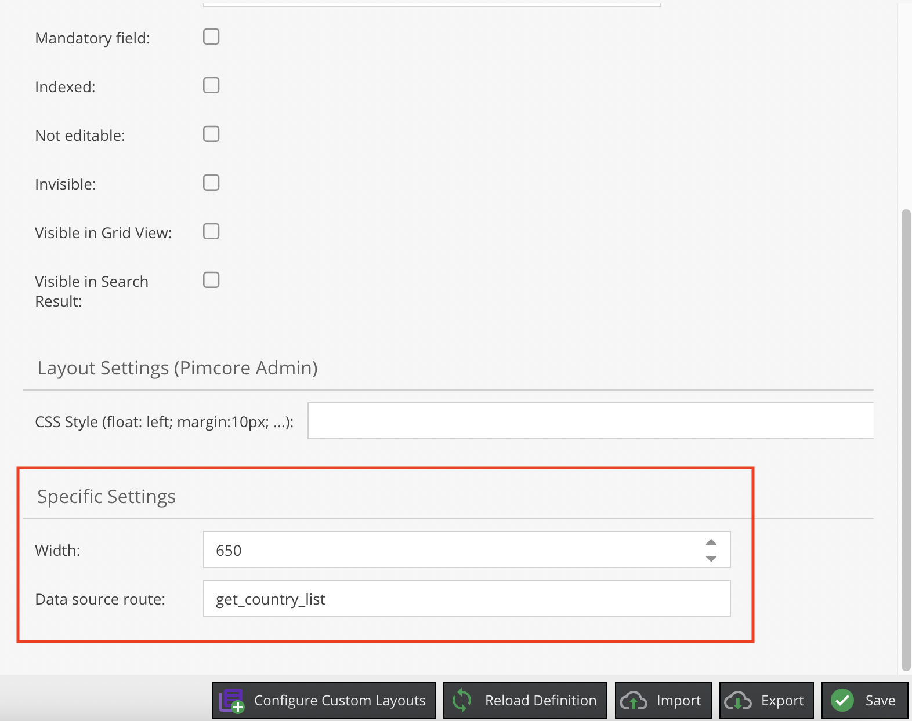

# Pimcore autocomplete field
The Autocomplete control allows to populate the drop-down list items asynchronously

Useful when OptionProvider receives a lot of data.

Object view


Classes editor view

## Installation

1. Install the package via composer:

```bash
    composer require buyanov/pimcore-autocomplete-field
```

2. Register new bundle in your AppKernel.php

```php
    public function registerBundlesToCollection(BundleCollection $collection): void
    {
        /// ...
        $collection->addBundle(new \Buyanov\Autocomplete\AutocompleteBundle());
    }
```

## Usage example

1. Create controller action (only for example):

```php
    /**
     * @Route("/api/country", name="get_country_list", methods={"GET"})
     *
     * @param Request $request
     *
     * @return Response
     */
    public function getCountriesAction(Request $request): Response
    {
        $value = $request->get('value');
        $query = $request->get('query');
        $result = [];

        // for search by name with auto-suggest
        if ($query !== null) {
            $countries = (new Country\Listing())
                ->addConditionParam('name LIKE ?', "%$query%")
                ->setOrderKey('name')
                ->setOrder('ASC')
                ->load();


            foreach ($countries as $country) {
                $result[] = [
                    'key' => $country->getName(),
                    'value' => $country->getId(),
                ];
            }

            return JsonResponse::create($result);
        }

        // for display saved data
        $country = Country::getById((int) $value);

        if ($country !== null) {
            $result = [
                'key' => $country->getName(),
                'value' => $country->getId(),
            ];
        }

        return JsonResponse::create($result);
    }
```

## ToDo

 - [x] Simple tag with ajax search
 - [x] Example controller
 - [ ] Example with elasticsearch
 - [ ] Route validation
 - [ ] CSS support
 - [ ] Add table editor view